# KlassLookupTable patch

JDKs and Configs compared:
- **A** Lilliput HEAD
- **B** Lilliput HEAD + KLUT patch
- **C** Mainline OpenJDK

TOC

- [ParallelGC](#ParallelGC)
- [G1GC](#g1gc)
- [SerialGC](#SerialGC)
- [ShenandoahGC](#ShenandoahGC)
- [ZGC](#ZGC)

-----------------------

## ParallelGC

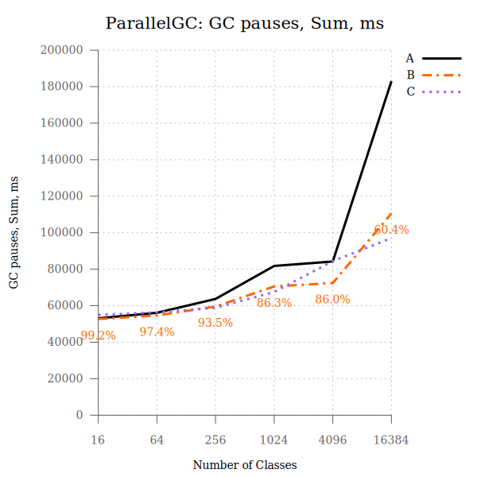 

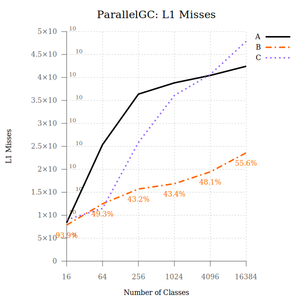 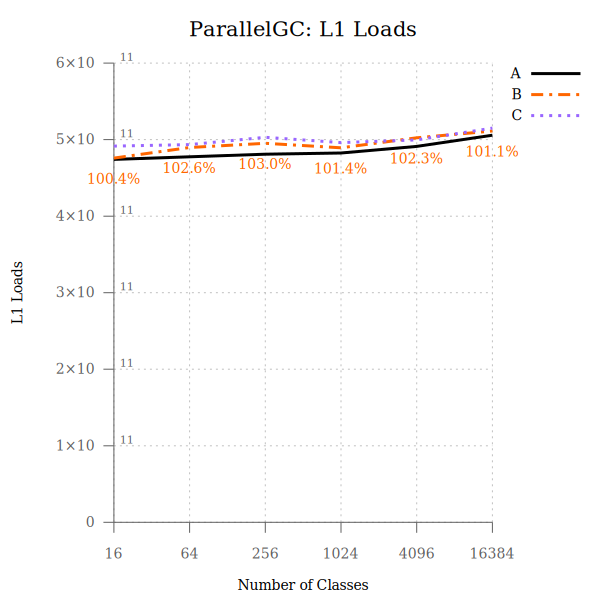 

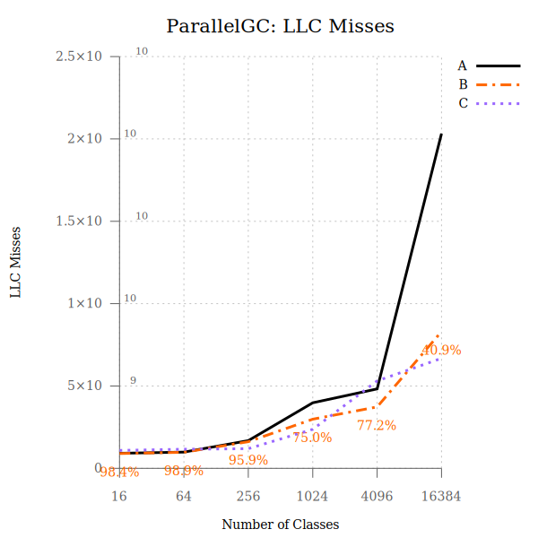 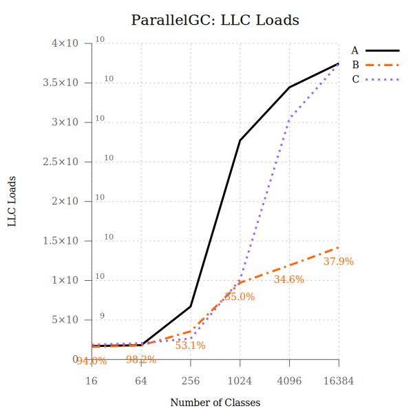 

 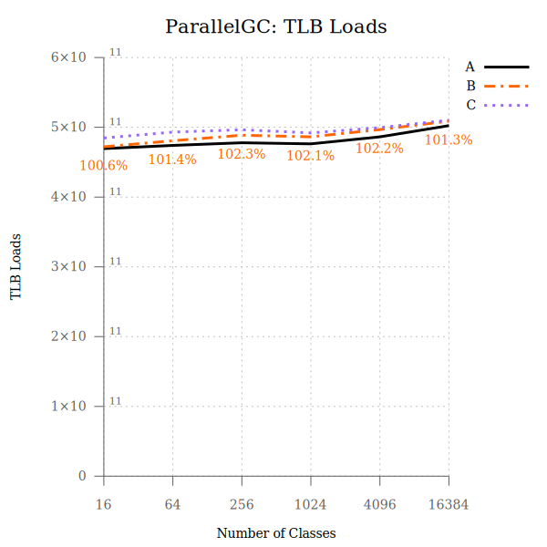

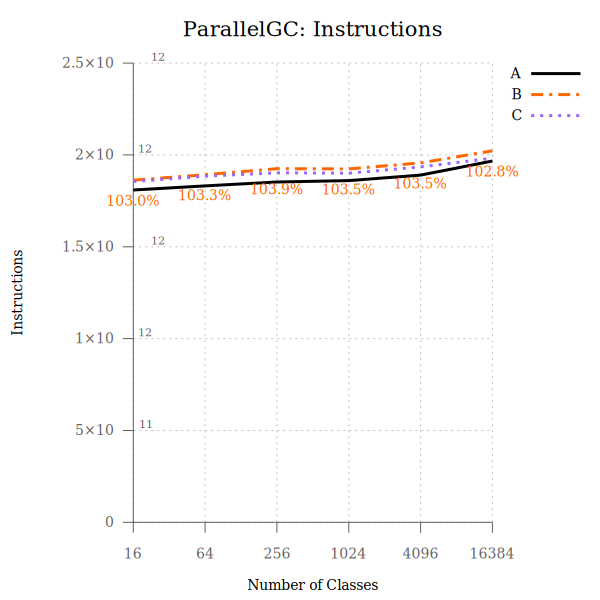 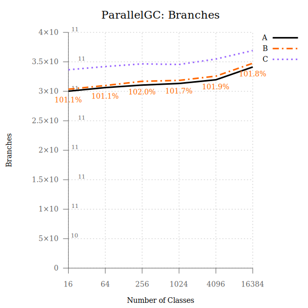

-----------------------

## G1GC

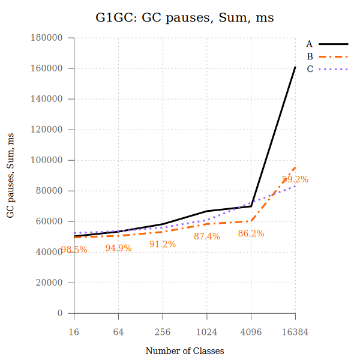

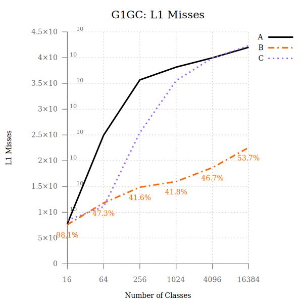 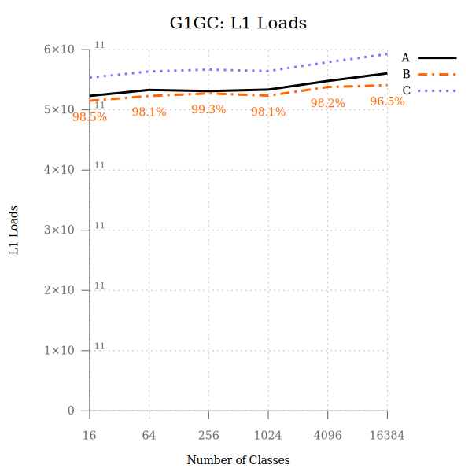

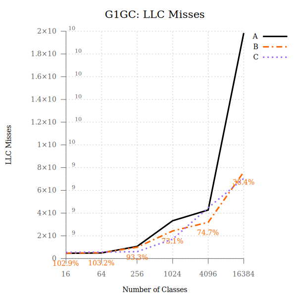 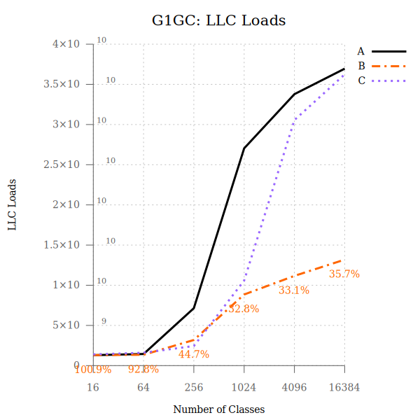

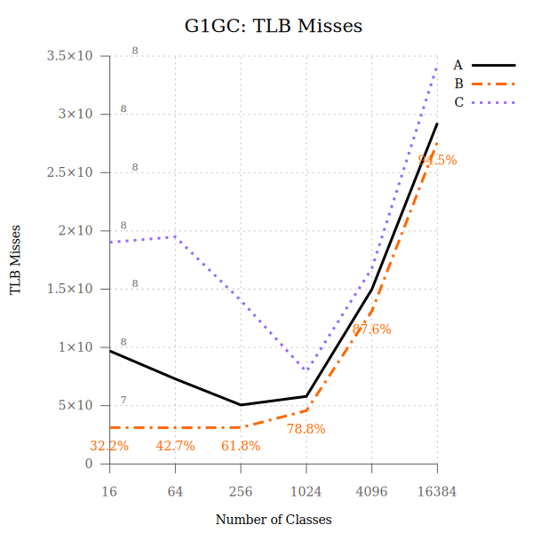 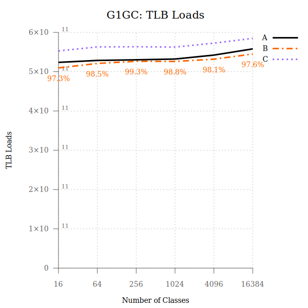

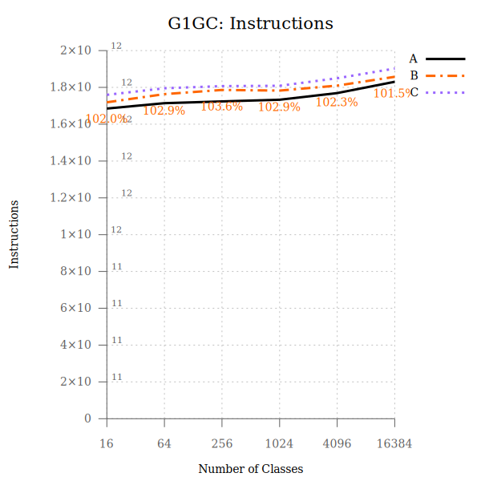 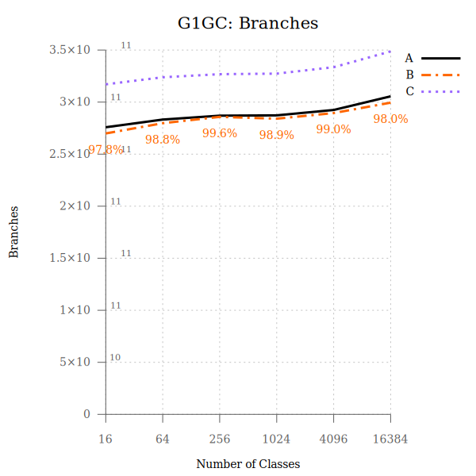

-----------------------

## SerialGC

 

 

 

 

-----------------------

## ShenandoahGC

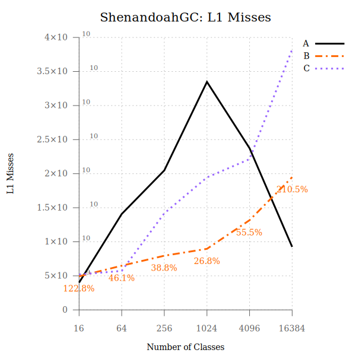 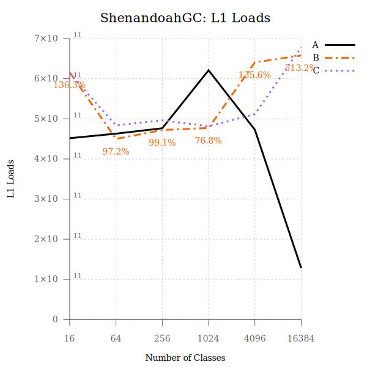

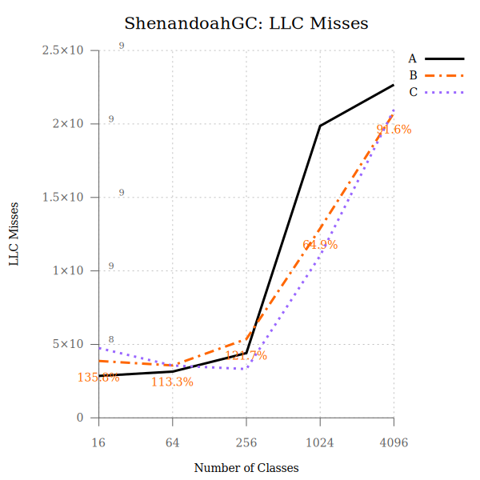 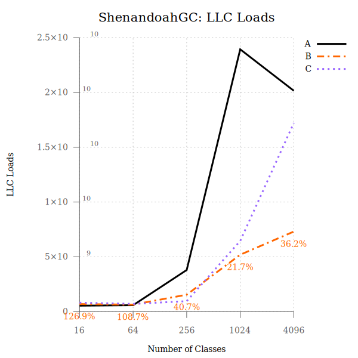

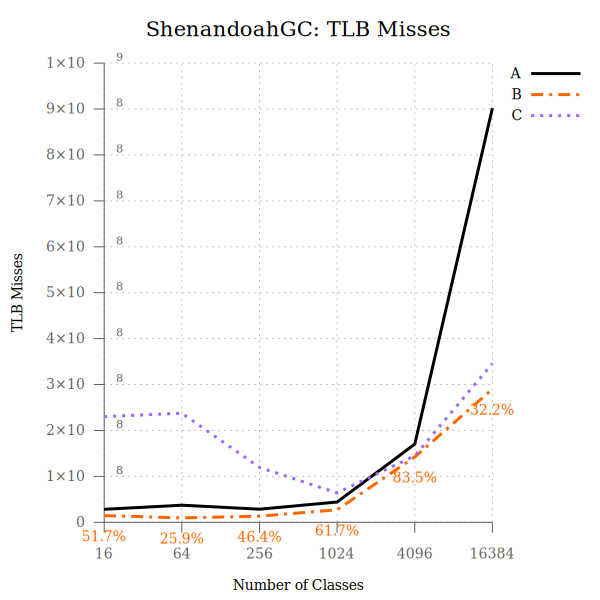 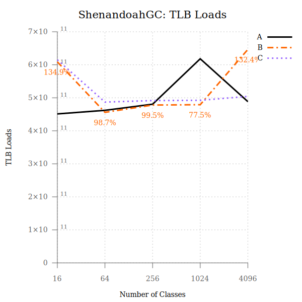

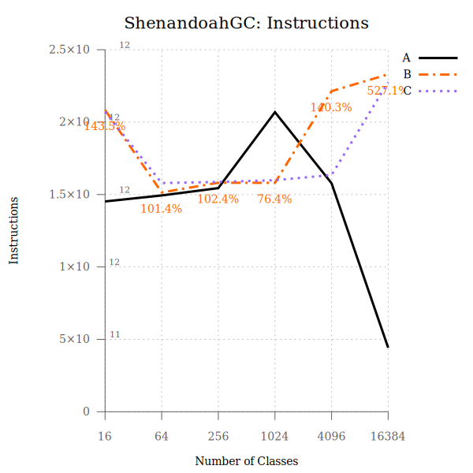 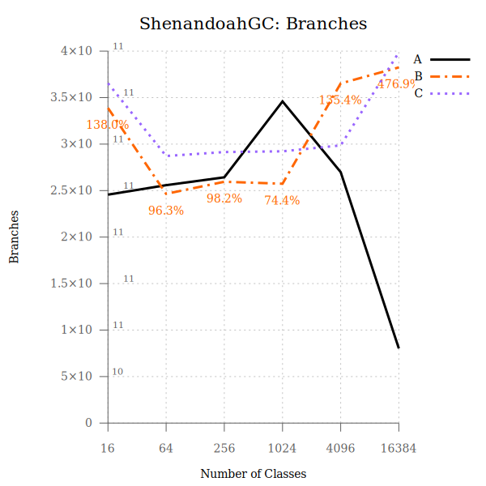

-----------------------

## ZGC

 

 

 

 

